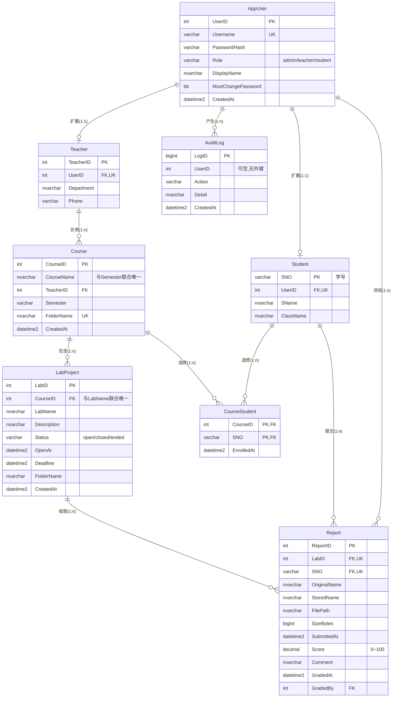

# 实验报告管理系统 · 数据库设计说明书

> 配套系统：Go (Gin) + SQL Server 的「实验报告管理系统」。
> 本文档严格对应已实现的库结构（见 `database.sql` 与 `db.go::migrate`），覆盖**需求分析 → 概念设计 → 逻辑设计 → 物理设计**四个阶段。
> 角色：DBA（admin）、教师（teacher）、学生（student）。

---

## 1 需求分析

### 1.1 系统目标

为高校实验课提供「教师布置实验项目 → 学生提交 PDF 报告 → 教师评分 → 成绩导出」的全流程线上管理，并满足：

- 统一登录与基于角色的权限控制；
- 教师用 Excel 批量导入课程与学生名单；
- 报告以「学号-姓名-实验项目名.pdf」规范命名、按课程/项目分目录存放；
- 每个实验项目每个学生**至多一份**有效报告（可覆盖重传）；
- 关键操作可审计。

### 1.2 角色与功能需求

| 角色 | 主要业务功能 |
| --- | --- |
| **DBA** | 系统总览统计、用户增删、重置密码、查看审计日志、全部课程一览 |
| **教师** | 导入/更新课程（自动建学生账户与选课关系）、开放/关闭/截止实验项目、查看学生名单、查看与下载报告（单份/打包 ZIP）、评分与评语、导出成绩 Excel |
| **学生** | 查看所选课程、查看实验项目状态、在开放且未截止的项目上传 PDF（≤ 8 MB）、下载本人报告 |

### 1.3 数据需求与业务流程（数据流）

```
教师导入 Excel ─► 创建[课程] + 批量建[学生账户] + 登记[选课] + 创建[实验项目]   （单事务）
教师开放实验项目（设置截止时间）─► 学生上传[报告]（UPSERT 覆盖）─► 教师[评分/评语] ─► 导出成绩
所有写操作 ─► 写入[审计日志]
```

由此抽取出需要持久化的核心数据：用户与身份、教师/学生扩展信息、课程、实验项目、选课关系、报告及其评分、操作审计。

### 1.4 实体识别

| # | 实体 | 说明 | 类型 |
| --- | --- | --- | --- |
| E1 | **AppUser**（用户） | 统一登录身份，所有角色共用 | 强实体 |
| E2 | **Teacher**（教师） | 教师专属属性（院系、电话） | 强实体（AppUser 的子类） |
| E3 | **Student**（学生） | 以学号标识 | 强实体（AppUser 的子类） |
| E4 | **Course**（实验课程） | 某学期某教师负责的一门课 | 强实体 |
| E5 | **LabProject**（实验项目） | 课程下的一个具体实验 | 强实体（依赖 Course） |
| E6 | **Report**（实验报告） | 学生对某实验项目的提交 | 关联实体（Student × LabProject） |
| E7 | **CourseStudent**（选课） | 学生与课程的选修关系 | 关联实体（Course × Student） |
| E8 | **AuditLog**（审计日志） | 关键操作流水 | 弱/独立实体 |

> 设计要点：把「教师/学生专属属性」从 AppUser 中下沉到 E2/E3，而不是在 AppUser 里堆 `Department`、`SNO` 等只对某一角色有效的列——既避免大量空值，也消除传递依赖（见 §3.5）。

### 1.5 属性识别

| 实体 | 标识属性 | 其他属性 |
| --- | --- | --- |
| AppUser | UserID | Username、PasswordHash、Role、DisplayName、MustChangePassword、CreatedAt |
| Teacher | TeacherID | UserID、Department、Phone |
| Student | SNO（学号） | UserID、SName、ClassName |
| Course | CourseID | CourseName、TeacherID、Semester、FolderName、CreatedAt |
| LabProject | LabID | CourseID、LabName、Description、Status、OpenAt、Deadline、FolderName、CreatedAt |
| CourseStudent | (CourseID, SNO) | EnrolledAt |
| Report | ReportID | LabID、SNO、OriginalName、StoredName、FilePath、SizeBytes、SubmittedAt、Score、Comment、GradedAt、GradedBy |
| AuditLog | LogID | UserID、Action、Detail、CreatedAt |

### 1.6 联系识别（含基数）

| 联系 | 双方 | 基数 | 含义 |
| --- | --- | --- | --- |
| 扩展(is-a) | AppUser — Teacher | **1:1** | 一个登录账号对应至多一条教师信息 |
| 扩展(is-a) | AppUser — Student | **1:1** | 一个登录账号对应至多一条学生信息 |
| 负责 | Teacher — Course | **1:n** | 一名教师负责多门课程，一门课属于一名教师 |
| 包含 | Course — LabProject | **1:n** | 一门课包含多个实验项目 |
| 选修 | Course — Student | **m:n** | 经 CourseStudent 分解 |
| 提交/收取 | Student — LabProject | **m:n** | 经 Report 分解（关联实体携带成绩、文件等属性） |
| 评阅 | AppUser — Report | **1:n** | 记录「谁批改了这份报告」（GradedBy） |
| 产生 | AppUser — AuditLog | **1:n** | 一个用户产生多条审计记录 |

---

## 2 概念结构设计

### 2.1 E-R 图

> 下图为带属性的实体-联系图（Mermaid 语法，可在支持 Mermaid 的 Markdown 查看器/Typora/VS Code 中渲染）。`PK`=主键，`FK`=外键，`UK`=唯一键。



### 2.2 实体-联系骨架（文本概览）

```
AppUser (统一身份 / 登录账号)
 ├─ 1:1 ── Teacher ── 1:n(负责) ── Course ── 1:n(包含) ── LabProject ─┐
 │                                   │                                │ 1:n
 │                                   │ m:n(选修)                      │ 收取
 │                                   └──── CourseStudent ────┐        ▼
 ├─ 1:1 ── Student ───── 1:n(提交) ────────────────────────►  Report  ◄── 关联实体
 │            └──────────── m:n(选修) ── CourseStudent ──────┘   (Student × LabProject,
 │                                                               UQ(LabID,SNO) ⇒ 一人一份)
 ├─ 1:n(评阅 GradedBy) ──► Report
 └─ 1:n(产生) ──────────► AuditLog (UserID 可空)
```

### 2.3 联系类型与设计依据

| 联系 | 类型 | 设计依据 |
| --- | --- | --- |
| AppUser–Teacher / AppUser–Student | 1:1 | 采用「超类-子类(ISA)」建模：统一鉴权走 AppUser，角色专属字段下沉到子类，避免空列与传递依赖；用 `UserID UNIQUE` 强制一个账号至多一条扩展记录 |
| Teacher–Course | 1:n | 一名教师可开多门课；课程必须有且仅有一名负责教师，故外键放在「n 端」Course 上 |
| Course–LabProject | 1:n | 实验项目是课程的从属对象，离开课程无意义 → 弱实体特征，外键放 LabProject 并级联删除 |
| Course–Student | m:n | 一个学生选多门课、一门课有多名学生；引入关联实体 `CourseStudent`，主键为两外键组合 |
| Student–LabProject | m:n | 用 `Report` 作关联实体分解：报告自带文件、分数、评语、时间等丰富属性，`UQ(LabID,SNO)` 把「每生每项目一份」约束落到数据层 |
| AppUser–Report（GradedBy） | 1:n | 与「提交」是两条不同语义的联系：提交方是学生，评阅方是教师/管理员，单独建外键以记录批改责任人 |
| AppUser–AuditLog | 1:n | `UserID` 可空且**不建外键**，使日志在对应用户被删除后仍保留，满足可追溯/合规需要 |

---

## 3 逻辑结构设计

### 3.1 E-R → 关系模式的转换规则

1. 每个实体 → 一张表，标识属性 → 主键；
2. 1:1 联系 → 在任一端加对方主键作外键并设 `UNIQUE`（本设计放在子类 Teacher/Student 的 `UserID` 上）；
3. 1:n 联系 → 在「n 端」加「1 端」主键作外键（Course.TeacherID、LabProject.CourseID、Report.LabID 等）；
4. m:n 联系 → 单独建关联表，主键为两端主键的组合（CourseStudent；Report 另以代理键 ReportID 为主键并对 (LabID,SNO) 加唯一约束）。

### 3.2 关系模式总览

> 约定：<u>下划线</u>=主键，*斜体*=外键。

- AppUser(<u>UserID</u>, Username, PasswordHash, Role, DisplayName, MustChangePassword, CreatedAt)　Username 唯一
- Teacher(<u>TeacherID</u>, *UserID*, Department, Phone)　UserID 唯一
- Student(<u>SNO</u>, *UserID*, SName, ClassName)　UserID 唯一
- Course(<u>CourseID</u>, CourseName, *TeacherID*, Semester, FolderName, CreatedAt)　(CourseName,Semester) 唯一、FolderName 唯一
- LabProject(<u>LabID</u>, *CourseID*, LabName, Description, Status, OpenAt, Deadline, FolderName, CreatedAt)　(CourseID,LabName) 唯一
- CourseStudent(<u>*CourseID*</u>, <u>*SNO*</u>, EnrolledAt)
- Report(<u>ReportID</u>, *LabID*, *SNO*, OriginalName, StoredName, FilePath, SizeBytes, SubmittedAt, Score, Comment, GradedAt, *GradedBy*)　(LabID,SNO) 唯一
- AuditLog(<u>LogID</u>, UserID, Action, Detail, CreatedAt)

### 3.3 各表结构明细

> 目标 DBMS：SQL Server。`NVARCHAR` 用于可能含中文的文本，`VARCHAR` 用于纯 ASCII；时间统一 `DATETIME2` 存 UTC。

#### 表 1　AppUser（统一身份）

| 字段 | 数据类型(长度) | 约束 | 默认值 | 说明 |
| --- | --- | --- | --- | --- |
| UserID | INT IDENTITY(1,1) | **PK** | 自增 | 用户代理主键 |
| Username | VARCHAR(64) | NOT NULL, **UNIQUE** | — | 登录名；学生为学号 |
| PasswordHash | VARCHAR(128) | NOT NULL | — | bcrypt 哈希，不存明文 |
| Role | VARCHAR(16) | NOT NULL, **CHECK** ∈{admin,teacher,student} | — | 角色 |
| DisplayName | NVARCHAR(50) | NOT NULL | — | 显示姓名 |
| MustChangePassword | BIT | NOT NULL | 1 | 1=需强制改密 |
| CreatedAt | DATETIME2 | NOT NULL | SYSUTCDATETIME() | 创建时间 |

参照完整性：无外出引用（被 Teacher/Student/Report/AuditLog 引用）。

#### 表 2　Teacher（教师）

| 字段 | 数据类型(长度) | 约束 | 默认值 | 说明 |
| --- | --- | --- | --- | --- |
| TeacherID | INT IDENTITY(1,1) | **PK** | 自增 | 教师代理主键 |
| UserID | INT | NOT NULL, **UNIQUE**, **FK**→AppUser(UserID) | — | 对应登录账号 |
| Department | NVARCHAR(80) | NULL | — | 院系 |
| Phone | VARCHAR(20) | NULL | — | 电话 |

参照完整性：`FK_Teacher_AppUser` **ON DELETE CASCADE**（删账号即删教师信息），ON UPDATE NO ACTION。

#### 表 3　Student（学生）

| 字段 | 数据类型(长度) | 约束 | 默认值 | 说明 |
| --- | --- | --- | --- | --- |
| SNO | VARCHAR(32) | **PK** | — | 学号（自然主键） |
| UserID | INT | NOT NULL, **UNIQUE**, **FK**→AppUser(UserID) | — | 对应登录账号 |
| SName | NVARCHAR(50) | NOT NULL | — | 姓名 |
| ClassName | NVARCHAR(50) | NULL | — | 班级 |

参照完整性：`FK_Student_AppUser` **ON DELETE CASCADE**，ON UPDATE NO ACTION。

#### 表 4　Course（实验课程）

| 字段 | 数据类型(长度) | 约束 | 默认值 | 说明 |
| --- | --- | --- | --- | --- |
| CourseID | INT IDENTITY(1,1) | **PK** | 自增 | 课程代理主键 |
| CourseName | NVARCHAR(100) | NOT NULL, **UNIQUE**(CourseName,Semester) | — | 课程名 |
| TeacherID | INT | NOT NULL, **FK**→Teacher(TeacherID) | — | 负责教师 |
| Semester | VARCHAR(20) | NOT NULL | '2025-2026-2' | 学期 |
| FolderName | NVARCHAR(160) | NOT NULL, **UNIQUE** | — | 落盘根目录名 |
| CreatedAt | DATETIME2 | NOT NULL | SYSUTCDATETIME() | 创建时间 |

参照完整性：`FK_Course_Teacher` **ON DELETE NO ACTION**（保护历史数据——删教师前须先转移/删除其课程，由应用层 `adminDeleteUserHandler` 校验）。

#### 表 5　LabProject（实验项目）

| 字段 | 数据类型(长度) | 约束 | 默认值 | 说明 |
| --- | --- | --- | --- | --- |
| LabID | INT IDENTITY(1,1) | **PK** | 自增 | 实验项目代理主键 |
| CourseID | INT | NOT NULL, **FK**→Course(CourseID), **UNIQUE**(CourseID,LabName) | — | 所属课程 |
| LabName | NVARCHAR(120) | NOT NULL | — | 实验项目名 |
| Description | NVARCHAR(500) | NULL | — | 描述 |
| Status | VARCHAR(16) | NOT NULL, **CHECK** ∈{open,closed,ended} | 'closed' | 状态 |
| OpenAt | DATETIME2 | NULL | — | 开放时间 |
| Deadline | DATETIME2 | NULL | — | 截止时间（空=不限） |
| FolderName | NVARCHAR(160) | NOT NULL | — | 项目子目录名 |
| CreatedAt | DATETIME2 | NOT NULL | SYSUTCDATETIME() | 创建时间 |

参照完整性：`FK_LabProject_Course` **ON DELETE CASCADE**（删课程级联删其实验项目），ON UPDATE NO ACTION。

#### 表 6　CourseStudent（选课关系，m:n）

| 字段 | 数据类型(长度) | 约束 | 默认值 | 说明 |
| --- | --- | --- | --- | --- |
| CourseID | INT | **PK**, **FK**→Course(CourseID) | — | 课程 |
| SNO | VARCHAR(32) | **PK**, **FK**→Student(SNO) | — | 学生 |
| EnrolledAt | DATETIME2 | NOT NULL | SYSUTCDATETIME() | 选课时间 |

参照完整性：复合主键 (CourseID, SNO) 天然防重复选课；`FK_CourseStudent_Course` **ON DELETE CASCADE**，`FK_CourseStudent_Student` **ON DELETE NO ACTION**（避免与 Course 形成多路径级联）。

#### 表 7　Report（实验报告，Student × LabProject 关联实体）

| 字段 | 数据类型(长度) | 约束 | 默认值 | 说明 |
| --- | --- | --- | --- | --- |
| ReportID | INT IDENTITY(1,1) | **PK** | 自增 | 报告代理主键 |
| LabID | INT | NOT NULL, **FK**→LabProject(LabID), **UNIQUE**(LabID,SNO) | — | 所属实验项目 |
| SNO | VARCHAR(32) | NOT NULL, **FK**→Student(SNO) | — | 提交学生 |
| OriginalName | NVARCHAR(260) | NOT NULL | — | 上传原始文件名 |
| StoredName | NVARCHAR(260) | NOT NULL | — | 规范化存储名 |
| FilePath | NVARCHAR(500) | NOT NULL | — | 磁盘相对路径 |
| SizeBytes | BIGINT | NOT NULL | — | 文件字节数 |
| SubmittedAt | DATETIME2 | NOT NULL | SYSUTCDATETIME() | 提交时间 |
| Score | DECIMAL(5,2) | NULL, **CHECK**(0≤Score≤100) | — | 成绩 |
| Comment | NVARCHAR(500) | NULL | — | 评语 |
| GradedAt | DATETIME2 | NULL | — | 评分时间 |
| GradedBy | INT | NULL, **FK**→AppUser(UserID) | — | 评分人 |

参照完整性：`FK_Report_Lab` **ON DELETE CASCADE**；`FK_Report_Student`、`FK_Report_Grader` **ON DELETE NO ACTION**。唯一约束 `UQ_Report_LabStudent(LabID,SNO)` 保证「一个实验项目每个学生至多一份报告」，配合 `MERGE` 实现覆盖式重传。

#### 表 8　AuditLog（操作审计）

| 字段 | 数据类型(长度) | 约束 | 默认值 | 说明 |
| --- | --- | --- | --- | --- |
| LogID | BIGINT IDENTITY(1,1) | **PK** | 自增 | 日志主键（BIGINT 防溢出） |
| UserID | INT | NULL（**无外键**） | — | 操作者；删用户后仍保留 |
| Action | VARCHAR(64) | NOT NULL | — | 动作（login/grade_report…） |
| Detail | NVARCHAR(500) | NULL | — | 详情 |
| CreatedAt | DATETIME2 | NOT NULL | SYSUTCDATETIME() | 时间 |

### 3.4 参照完整性与级联策略汇总

| 外键 | 子表 → 父表 | ON DELETE | ON UPDATE | 理由 |
| --- | --- | --- | --- | --- |
| FK_Teacher_AppUser | Teacher → AppUser | CASCADE | NO ACTION | 账号删除则教师扩展无意义 |
| FK_Student_AppUser | Student → AppUser | CASCADE | NO ACTION | 同上 |
| FK_Course_Teacher | Course → Teacher | NO ACTION | NO ACTION | 保护课程，删教师前须先处理课程 |
| FK_LabProject_Course | LabProject → Course | CASCADE | NO ACTION | 实验项目从属于课程 |
| FK_CourseStudent_Course | CourseStudent → Course | CASCADE | NO ACTION | 课程删除清除选课 |
| FK_CourseStudent_Student | CourseStudent → Student | NO ACTION | NO ACTION | 避免多路径级联 |
| FK_Report_Lab | Report → LabProject | CASCADE | NO ACTION | 删实验项目清除其报告 |
| FK_Report_Student | Report → Student | NO ACTION | NO ACTION | 保护历史成绩 + 避免多路径级联 |
| FK_Report_Grader | Report → AppUser | NO ACTION | NO ACTION | 保留评分责任人 |

> **多路径级联说明**：SQL Server 禁止同一张表经两条不同路径被级联删除。Report 已通过 LabProject 级联，故 Report→Student 不能再级联，否则「删 Student」会出现 Student→Report 与 Student→…→Report 的潜在冲突。因此 Student/Teacher 的删除改由应用层先做前置检查（有报告/有课程则拒绝）。

### 3.5 规范化分析（达到 3NF / BCNF）

- **1NF**：所有字段均为原子值，无重复组、无多值列（文件本身存磁盘，库内只存路径与元数据）。✔
- **2NF**：唯一的复合主键表是 `CourseStudent`，其非主属性 `EnrolledAt` 完全函数依赖于整个主键 (CourseID, SNO)，无部分依赖；其余表均为单列主键，自动满足 2NF。✔
- **3NF**：各表非主属性只直接依赖主键，无传递依赖。典型处理：
  - 课程不存教师院系（`CourseID → TeacherID → Department` 这种传递依赖被消除，Department 只在 Teacher 表）；
  - 报告不存学生姓名/实验名（只存 SNO、LabID 外键，展示时 JOIN 取得），避免冗余与更新异常。✔
- **BCNF**：每个函数依赖的决定因素都是候选键（如 Report 中 ReportID、(LabID,SNO) 均为候选键，不存在非键决定因素），达到 BCNF。✔

**关于受控冗余（派生但持久化的字段）**——这是有意为之、且不破坏 3NF：

| 字段 | 派生自 | 为何仍单独存储 | 是否违反 3NF |
| --- | --- | --- | --- |
| Course.FolderName / LabProject.FolderName | 课程名/实验名净化结果 | 与磁盘目录绑定；即便将来改名，历史文件仍可定位 | 否：其决定因素 (CourseName,Semester)、(CourseID,LabName) 本身是候选键 |
| Report.StoredName / FilePath | 学号-姓名-实验名 + 目录 | 记录「提交那一刻」的物理位置，是业务快照，不应随后续改名漂移 | 否：相对 ReportID 为普通属性，属审计性快照 |

---

## 4 物理结构设计

### 4.1 索引设计总表

| 索引 | 表 | 列 | 类型 | 来源 | 服务的查询 / 依据 |
| --- | --- | --- | --- | --- | --- |
| PK_*（各表） | 全部 | 主键列 | 聚簇·唯一 | PK | 按主键点查；IDENTITY 主键单调递增，插入无页分裂热点 |
| UQ AppUser.Username | AppUser | Username | 唯一 | UNIQUE | 登录按用户名等值查找 |
| UQ Report (LabID,SNO) | Report | LabID, SNO | 唯一·组合 | UNIQUE | 「某生在某实验项目的报告」等值查 + 上传 MERGE 定位 + 防重复 |
| UQ Course (CourseName,Semester) / FolderName | Course | — | 唯一 | UNIQUE | 防同名同学期课程；目录名全局唯一 |
| UQ LabProject (CourseID,LabName) | LabProject | — | 唯一·组合 | UNIQUE | 同课程内实验项目名不重复 |
| IX_Course_Teacher | Course | TeacherID | 非聚簇·**外键索引** | 显式 | 教师/管理员列课程时 Teacher⋈Course 连接 |
| IX_CourseStudent_SNO | CourseStudent | SNO | 非聚簇·**外键索引** | 显式 | 学生登录「按学号反查所选课程」（主键以 CourseID 打头，无法服务 SNO 单列查） |
| IX_Report_SNO | Report | SNO | 非聚簇·**外键索引** | 显式 | 按学号查报告、删除学生前的报告校验、学生下载本人报告 |
| IX_LabProject_CourseStatus | LabProject | CourseID, Status | 非聚簇·**组合** | 显式 | 「列某课程下实验项目」并按状态过滤（教师工作台、统计开放/关闭数） |
| IX_Report_LabSubmitted | Report | LabID, SubmittedAt **DESC** | 非聚簇·**组合·降序** | 显式 | 教师查某实验项目报告并按提交时间倒序展示（`ORDER BY SubmittedAt DESC`） |
| IX_AuditLog_Created | AuditLog | CreatedAt **DESC** | 非聚簇·降序 | 显式 | 审计日志按时间倒序/时间范围检索 |

### 4.2 索引选择依据

1. **主键索引（聚簇）**：所有表主键均为 `IDENTITY` 代理键或稳定的学号自然键，单调/稳定 → 聚簇索引插入顺序友好、点查最快。
2. **唯一索引兼顾约束与检索**：`Username`、`(LabID,SNO)`、`(CourseID,LabName)`、`FolderName` 既保证业务唯一性，又直接成为高频等值查询的加速结构（一举两得，无需额外建索引）。
3. **外键索引按需手建**：SQL Server **不会**为外键自动建索引，而本系统大量按外键做连接/过滤（`Course.TeacherID`、`Report.SNO`、`CourseStudent.SNO`），若缺索引则父表删除与连接退化为全表扫描，故显式补建。
4. **组合索引遵循「等值列在前、范围/排序列在后」**：
   - `IX_LabProject_CourseStatus(CourseID, Status)`：先按课程等值定位，再按状态过滤，符合最左前缀；
   - `IX_Report_LabSubmitted(LabID, SubmittedAt DESC)`：先按实验项目定位，索引内已按提交时间倒序排好，使 `ORDER BY SubmittedAt DESC` 免排序算子。
5. **降序索引对齐 ORDER BY**：报告列表、审计日志都是「最新在前」，故对排序列直接建 `DESC` 索引。
6. **不为低选择性/低频列建索引**：如 `Role`、`Status` 单独建索引意义不大（取值少、选择性低），只在与高选择性列组合时才纳入。
7. **写放大权衡**：每个非聚簇索引都会增加写入与存储成本，因此索引数量控制在「确有高频读查询支撑」的范围内；统计类 `COUNT(*)`（系统总览）数据量小、频率低，不为其专门建索引。

### 4.3 其他物理与性能考量

- **数据类型与长度**：含中文文本用 `NVARCHAR`（姓名、课程/实验名、评语、院系），纯 ASCII 用 `VARCHAR`（用户名、角色、学号、电话、目录名内部为净化串）；成绩用 `DECIMAL(5,2)` 精确表示 0~100.00；文件大小用 `BIGINT` 防大文件溢出；时间统一 `DATETIME2` 存 UTC，跨时区一致。长度按业务上限留余量（如文件名 260 对齐 Windows 文件名上限，PasswordHash 128 容纳 bcrypt 的 60 字符并留扩展空间）。
- **CHECK 约束前移**：`Role`、`Status` 枚举与 `Score` 范围在数据层校验，避免脏数据，也便于优化器了解取值分布。
- **审计表与业务表解耦**：`AuditLog` 无外键、可空 UserID，写入失败不阻塞主流程（应用层「尽力写」），避免审计成为业务事务的瓶颈或单点失败。
- **事务与并发**：导入课程、上传报告均在事务内完成；上传用 `MERGE` 把「查—改/插」收敛为一条原子语句，配合 `UQ(LabID,SNO)` 在默认 Read Committed 隔离级别下也能避免并发重复插入。

---

## 附录：完整 DDL

可执行建库脚本见仓库根目录 `database.sql`（先 `CREATE DATABASE ExpReport` 再切库执行）；程序首次启动时 `db.go::migrate` 会自动执行等价的「存在则跳过」建表与建索引语句，二者保持一致。
